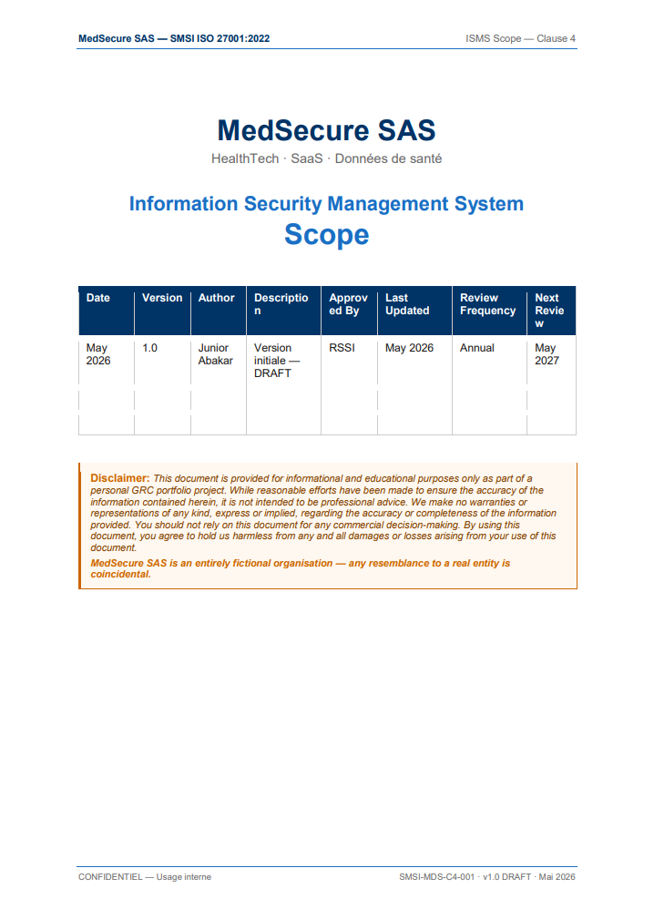

# Clause 4 — Contexte de l'organisation

Je commence mon analyse par la clause 4. J'ai délibérément écarté les clauses informatives de ce projet, car elles ne font pas partie du périmètre d'un audit de certification ISO 27001. Si elles vous intéressent, je vous invite à consulter <a href="https://www.iso.org/obp/ui/fr/#iso:std:iso-iec:27001:ed-3:v1:fr">la norme officielle</a> (disponible en anglais et en français).

Seules les clauses normatives seront donc traitées ici.

> **Note** : Le modèle de document utilisé a été conçu sur mesure — aucun template préexistant n'a été utilisé. La structure, la mise en forme et le contenu ont été entièrement produits dans le cadre de ce projet.

## Livrable

**Le présent document est rédigé en anglais conformément aux standards ISO 27001 et aux pratiques des cabinets de conseil en cybersécurité. En voici un aperçu :**

## Raisonnement
On commence par l'évidence : la page de garde ci-dessus.

Cette page a pour but principal le **contrôle de version**, indissociable du processus d'amélioration continue du SMSI, et donc d'une importance capitale. On y renseigne deux types d'informations :

- **Informations temporelles** : version, date d'édition, date de dernière mise à jour, date de prochaine révision et fréquence de revue
- **Informations organisationnelles** : auteur, approbateur du document et description synthétique de la version
